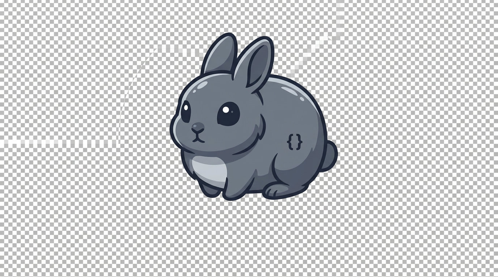

# rabbit-code

<p align="center">
  
</p>

**rabbit-code** is a Go reimplementation of an **interactive coding agent** in the same product class as **Claude Code**: a long-running **query engine** that talks to a model API, streams replies, runs **tools** (file edits, shell, search, etc.), negotiates **permissions**, speaks **MCP** to external servers, and persists **sessions / transcripts**. Everything is meant to ship as a **single CLI binary** with a **full-screen terminal UI** for day-to-day use, plus a rich **subcommand surface** for doctor flows, resume, configuration, and automation-friendly entry points.

The project aims for **behavioral parity** with a well-defined reference architecture (engine states, tool loop, compacting, hooks, slash commands, tasks/agents/skills/plugins, bridge and remote modes, policy and telemetry hooks, and voice where the OS allows). It is **not** scoped as a toy REPL or a “later we will add X” codebase: each major capability is supposed to land as a complete, testable slice rather than a permanent stub.

Go module: [`github.com/2456868764/rabbit-code`](https://github.com/2456868764/rabbit-code). Treat **`rabbit-code/`** (alongside `go.mod`) as the module root.

---

## What gets built

**Runtime core (headless-capable)**  
Orchestrates the agent loop: submit prompts, handle streaming tokens, schedule tool calls, apply permission rules and audit trails, merge MCP resources and tool results back into context, manage session identity and transcript storage, and enforce compaction and token budget policies where the architecture calls for them. Slash commands, task runners, and plugin boundaries are first-class so the CLI and TUI do not reimplement business rules in duplicate.

**Terminal UI**  
A Bubble Tea application provides the primary interactive experience: **REPL-style** conversation, **Doctor**-style diagnostics, **session resume** pickers, **permission** and **MCP approval** dialogs, structured **diff** and log views, **spinners** and status chrome, **light/dark/custom themes**, a coherent **keybinding** layer (including **Vim-style** input modes where specified), and multi-pane layouts when the product model requires them.

**CLI**  
The same binary exposes a structured command tree for non-interactive and scripted use: help text, stable flags, consistent exit codes, and automated tests or scripted checks so regressions are caught in CI.

**Integrations**  
IDE **bridge**, **direct connect / server** modes, **remote** and **upstream proxy** paths, **managed policy** settings, **telemetry** (off by default or user-controlled per policy), and **voice** input/output are part of the same product surface—not optional side repos—subject only to honest **platform exemptions** where an OS cannot support a feature.

---

## Architecture choices

- **Core vs UI:** Packages such as `internal/engine`, `internal/query`, and `internal/tools` **do not import** the TUI framework. The UI subscribes to **`EngineEvent`** streams and emits **`UserIntent`** through channels or narrow interfaces so the engine can be unit-tested and run without a terminal.
- **UI stack:** [Bubble Tea v2](https://github.com/charmbracelet/bubbletea) (`charm.land/bubbletea/v2`, e.g. **v2.0.2**) for the Elm-style loop, [Bubbles v2](https://github.com/charmbracelet/bubbles) (`charm.land/bubbles/v2`) for reusable widgets (text inputs, lists, viewports, spinners, …), and [Lip Gloss v2](https://github.com/charmbracelet/lipgloss) (`charm.land/lipgloss/v2`, e.g. **v2.0.2**) for layout and theming.
- **Quality bar:** Non-UI packages target high line coverage on critical paths; TUI code favors **model reduction tests** and **stable string snapshots** of rendered views so refactors do not silently break layouts or key handling.

### Headless engine (`internal/engine`, Phase 5)

**`engine.Engine`** drives **`query.RunTurnLoop`** when **`Config.Deps`** supplies **`Assistant`** and/or **`Turn`** (`querydeps`). Subscribe via **`Events()`** to **`EngineEvent`**: user submit, assistant text, tool start/done, optional memdir inject, orphan-permission hint, compact suggestions, **`Done`**, or **`Error`** (with **`APIErrorKind`** / **`RecoverableCompact`** when the error unwraps to **`anthropic.APIError`**).

**`Config`** highlights: **`Deps`**, **`Model`** / **`MaxTokens`**, **`MemdirPaths`**, **`MaxAssistantTurns`** (→ **`query.LoopState.MaxTurns`**), **`SuggestCompactOnRecoverableError`**, **`CompactAdvisor`**, **`CompactExecutor`** (optional second return **`nextTranscriptJSON`** for **`RecoverStrategy`** retry seeding, and for **H1** **`RABBIT_CODE_PROMPT_CACHE_BREAK_AUTO_COMPACT`** in-loop recovery), **`StopHooks`** / **`StopHook`** (defer, after each Submit attempt), **`OrphanPermissionAdvisor`**, **`TemplateDir`**. **H6 / query-loop parity (headless):** **`StopHooksAfterSuccessfulTurn`** (runs after a successful turn wave, before token-budget continuation; supports **`preventContinuation`** → early **`Done`** with **`PhaseDetail`**, and **`blockingContinue`** like **`stop_hook_blocking`**), **`StopHookBlockingContinue`**, **`TokenBudgetContinueAfterTurn`**, **`RecoverStrategy`**, **`ContextCollapseDrain`**, **`AgentID`**, **`SessionID`**, **`Debug`**, **`NonInteractive`** (wired into **`query.LoopState.ToolUseContextMirror`**). **H1 (prompt cache break, SSE):** with **`RABBIT_CODE_PROMPT_CACHE_BREAK_DETECTION`**, **`RABBIT_CODE_PROMPT_CACHE_BREAK_TRIM_RESEND`** (default on; set **`0`** to disable) strips **`cache_control`** and retries **`AssistantTurn`** once; optional **`RABBIT_CODE_PROMPT_CACHE_BREAK_AUTO_COMPACT`** + **`CompactExecutor`**; **`EventKindPromptCacheBreakRecovery`** (**`PhaseDetail`**: **`trim_resend`** / **`compact_retry`**). Use **`make test-phase5`** for the Phase 5 package set.

---

## Quick start

Requires **Go 1.25+** (Charm **Bubble Tea / Lip Gloss / Bubbles v2** stacks).

```bash
cd rabbit-code
go test ./... -count=1
make build          # output: bin/rabbit-code
./bin/rabbit-code version
```

**启动画面（TTY）**：默认在标准错误输出打印吉祥物（iTerm2 / WezTerm 等支持 **内联 PNG**；其余终端为 Lip Gloss 文字框）。CI 或管道可设 `RABBIT_CODE_NO_STARTUP_BANNER=1` 或 `RABBIT_CODE_EXIT_AFTER_INIT=1` 关闭。

- **Lint:** install [golangci-lint](https://golangci-lint.run/), then `make lint`.
- **Docker:** `docker build -t rabbit-code:local .` and `docker run --rm rabbit-code:local version` (build context = this directory).

**Makefile:** `build`, `test`, `test-race`, `lint`, `e2e`, `e2e-tui`. The `e2e*` targets exist for future integration pipelines; until those suites exist they may succeed as no-ops.

---

## CI

If this tree sits inside a monorepo (e.g. parent folder **`bot/`**), automation typically lives under the parent’s `.github/workflows/` and sets **`working-directory: rabbit-code`** for Go steps. If **`rabbit-code/`** is the git repository root, use the same jobs from your own `.github/workflows/` at that root and drop the nested working-directory.

---

## Binary

Entry command: **`rabbit-code`** (`cmd/rabbit-code`).

---

## License

See [`LICENSE`](LICENSE).

---

*Compliance note:* implement behavior from public specifications and your own design artifacts; do not ship verbatim copies of third-party source you are not entitled to redistribute; honor API and trademark terms of external services.
